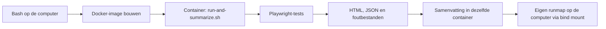

# Presentatiedocumentatie: Lancyr testen met Playwright

Dit project is een technische proef voor een toekomstige centrale testsuite voor Novulo-applicaties. De huidige tests bezoeken de live Lancyr-autoverzekeringsfunnel en stoppen vóór **Sluit af**.

## 1. Het project in 30 seconden

```bash
bash scripts/run-lancyr-browsers.sh
```

Drie functionele tests draaien in Chromium, Firefox en WebKit: negen testcombinaties. Docker voert zowel de tests als de rapportverwerking uit. Iedere run krijgt een eigen map met uitslag, HTML-rapport en eventuele foutbestanden.

**Vertel dit:** “Playwright speelt een klantreis na. Controles bepalen of de site doet wat we verwachten. Docker levert de vastgelegde browseromgeving.”

## 2. Architectuur



[scripts/run-lancyr-browsers.sh](scripts/run-lancyr-browsers.sh) bouwt de image en maakt de runmap. De container gebruikt [scripts/run-and-summarize.sh](scripts/run-and-summarize.sh) om tests uit te voeren en daarna [scripts/summarize-lancyr-run.mjs](scripts/summarize-lancyr-run.mjs) aan te roepen. De samenvatting wordt ook na een testfout gemaakt; de test-exitcode blijft behouden. Een rapportagefout na geslaagde tests geeft eveneens een foutcode. Bij een container die niet start of abrupt stopt is een samenvatting niet gegarandeerd.

Er is geen centraal groeiend resultatenlogboek. Resultaten staan uitsluitend per run onder `test-runs/`.

## 3. Bestanden en verantwoordelijkheden

| Bestand | Taak |
| --- | --- |
| `test/autoverzerkeringsfunnel/lancyr-autoverzekering.spec.ts` | Drie functionele tests; optionele bewuste fout aan het einde van de funnel. |
| `test/autoverzerkeringsfunnel/lancyr-visual.spec.ts` | Aparte visuele vergelijking van de startpagina in Chromium. |
| `test/autoverzerkeringsfunnel/lancyr-visual.spec.ts-snapshots/` | Referentiescreenshot, te beoordelen en samen met de test te versioneren. |
| `scripts/run-lancyr-browsers.sh` | Start headless, headed, visible of funnel-demo. |
| `scripts/run-lancyr-visual.sh` | Start referentieopname, visuele vergelijking of CSS-demo. |
| `scripts/run-and-summarize.sh` | Tests en rapportverwerking in Docker; bewaart foutcodes. |
| `scripts/summarize-lancyr-run.mjs` | JSON-resultaten omzetten naar `SAMENVATTING.md`. |
| `scripts/create-visual-overview.mjs` | Maakt het visuele overzicht met referentie, actueel beeld en verschil. |
| `scripts/start-viewer.sh` | Start het virtuele scherm en noVNC voor live meekijken. |
| `playwright.config.ts` | Centrale browserprojecten, parallelisme en foutmateriaal. |
| `Dockerfile` en `docker/Dockerfile.viewer` | Basisimage en uitbreiding voor live meekijken. |
| `package.json`, `package-lock.json`, `.nvmrc`, `.npmrc` | Vastgelegde tooling en dependencies. |
| `tsconfig.json` | TypeScript-controle. |

Git bewaart code, configuratie, documentatie en de referentiescreenshot. Gegenereerde rapporten, traces, runmappen en `node_modules/` blijven buiten Git. `.dockerignore` houdt oude resultaten en lokale dependencies ook buiten de Docker-buildcontext. Controleer de actuele branch en wijzigingen met `git branch --show-current` en `git status`. Commit en push zijn afzonderlijke handelingen.

## 4. De functionele controles

De tests controleren de zichtbare ingang van de premieberekening, het tegenhouden van een leeg kenteken en de volledige route tot de winkelwagen.

De lange klantreis heeft zes benoemde stappen:

1. Homepage en menu: Privé verzekeren → Auto.
2. Kenteken invullen en wachten op de verwachte voertuiggegevens.
3. Adres, geboortedatum, ondernemerschap, gezinssamenstelling en privacykeuze invullen.
4. Bestuurder, schadevrije jaren, kilometrage en ingangsdatum invullen; premie berekenen.
5. De dekking uit het database-scenario kiezen, geselecteerde dekking en een positieve premie controleren, afgesproken aanbod kiezen.
6. Winkelwagen controleren: dekking en extra opties volgens het scenario, **Sluit af** zichtbaar. Bij Kind-inwonend stopt de test al in stap 4 na de verwachte blokkade. Bij Partner wordt een extra geboortedatum ingevuld. Zie de scenariomatrix in [README-testdata.md](README-testdata.md).

Het testkenteken en de voertuigverwachting worden samen met de overige scenariogegevens uit SQLite opgehaald. De datum schuift naar de eerstvolgende 20 september. De premie staat niet vast; het gewenste productnummer en de extra dekkingen horen bij het scenario.

**Vertel dit:** “Een klik is geen bewijs dat iets werkt. Daarom controleren we ook de volgende pagina en de ingevulde waarden.”

`getByRole`, `getByText` en `locator` vinden elementen. `fill`, `click`, `check` en `selectOption` bedienen de site. `expect` controleert het resultaat. `test.step` groepeert de klantreis in het rapport. De helpers `sluitCookieMelding`, `vulVeld` en `bepaalIngangsdatum` voorkomen herhaling. De runner valideert het database-scenario vooraf; de funneltest haalt dit op via SQL en bewaart de gebruikte waarden als rapportbijlage. Zie [Testdata uit SQLite](README-testdata.md).

## 5. Docker en uitvoermodi

| Modus | Browsers | Workers | Gebruik |
| --- | --- | --- | --- |
| Headless | Chromium, Firefox, WebKit | 2 | Gewone automatische uitvoering. |
| Headed | Chromium, Firefox, WebKit | 2 | Browser op een virtueel scherm. |
| Visible | Chromium, Firefox, WebKit | 1 | Live meekijken via noVNC, browsers achtereenvolgens. |
| Funnel-demo | Chromium headless | 1 | Bewuste fout na de gewone klantreis, zonder retries. |
| Visuele proef | Chromium headless | 1 | Aparte screenshotvergelijking, zonder retries. |

De basisimage bevat Playwright-browsers en Linux-bibliotheken. De Dockerfile neemt Node uit een vastgelegde Node-image over, controleert Node/npm en installeert dependencies met `npm ci`. De twee basisimages zijn met digests vastgezet. De viewer-image voegt noVNC, websockify en x11vnc toe. Beide images gebruiken dezelfde testcode.

`--rm` verwijdert de tijdelijke container; de image blijft bestaan. `--user` laat rapporten met de gebruikersrechten van de host schrijven. De bind mount koppelt de runmap aan `/app/test-runs/<runnaam>` in de container. `--reporter=list,html,json` levert terminaluitvoer, HTML en JSON. Het standaard-CMD start alleen Playwright; de runners gebruiken de wrapper voor samenvattingen.

Voor de shellroute hebben collega's Docker, Bash en de projectbestanden nodig. Lokale Node/npm zijn alleen nodig voor lokale npm-commando's of ontwikkelcontroles. De visible-modus vereist een interactieve terminal. De viewer is alleen op localhost beschikbaar en staat alleen meekijken toe. Zie [README.md](README.md) voor de commando's en versieafspraken.

## 6. Rapporten en demonstraties

Iedere run krijgt een unieke map met datum, tijd en modus. `SAMENVATTING.md` geeft de uitslag; `html/index.html` toont tests en stappen; `results.json` bevat de machineleesbare resultaten. Screenshots en traces worden bij fouten bewaard in `test-results/`.

Open het HTML-rapport via Live Preview in VS Code. Bij een gefaalde test kun je de trace openen om met acties en tijdlijn te onderzoeken wat er vóór en na iedere actie gebeurde. Geslaagde runs bewaren geen trace.

### Fouttrace van de funnel

```bash
bash scripts/run-lancyr-browsers.sh funnel-demo
```

Deze run gebruikt de gewone funneltest en voegt alleen in de demonstratiemodus een zevende controle toe: een bewust verkeerde koptekst in de winkelwagen. Het rapport vermeldt expliciet DEMO. Controleer dat de fout bij die stap ontstond, niet door een eerdere storing. Er wordt niet op **Sluit af** geklikt.

### Visuele regressie

```bash
bash scripts/run-lancyr-visual.sh
bash scripts/run-lancyr-visual.sh demo
```

De eerste vergelijkt de actuele pagina met de referentie. De tweede verschuift het kentekenveld alleen in de testbrowser en hoort daardoor te falen. Open `VISUEEL-OVERZICHT.html` voor **Zo hoort het**, **Zo ziet het er nu uit** en **Dit wijkt af**. De actuele screenshot blijft ook bij een geslaagde visuele test bewaard. Referenties worden alleen met het expliciete `reference`-commando vernieuwd en moeten visueel beoordeeld worden. Zie [README-visual-test.md](README-visual-test.md).

**Vertel dit:** “Een rode test vraagt onderzoek. Een echte fout, gewijzigde verwachting, selector of wachttijd kan de oorzaak zijn. Onze demonstratiefouten zijn bewust ingebouwd en als zodanig gemarkeerd.”

## 7. Grenzen en vervolgstappen

Een geslaagde run bewijst alleen dat de geselecteerde controles met die gegevens en browsers op dat moment slaagden. De proef bewijst niet dat alle invoer, mobiele schermen, premiebedragen of een definitieve aanvraag correct werken. Eerdere funnelstappen doen al serververzoeken, ook zonder op **Sluit af** te klikken.

Vervolgwerk omvat een echte project-API-test, meerdere omgevingen, veilige secrets/testdata, meer scenario's en centrale CI-uitvoering. Video is nog niet ingeschakeld. Snelheid, CPU en geheugen zijn nog niet reproduceerbaar vergeleken. Visible en headless zijn geen directe benchmark door verschillende workers en viewerprocessen.

Er is geen CI-workflow. `playwright.config.ts` bevat wel CI-instellingen, maar de runner geeft `CI` niet expliciet door en stelt zelf workers in. Nieuwe testbestanden draaien niet vanzelf mee met de funnelrunner. Een toekomstige pipeline moet rapporten en traces expliciet als artifacts bewaren. Voor veel applicaties zijn centrale runners en afstemming met IT/DevOps nodig.

## 8. Voorstel voor de presentatie

| Onderdeel | Laat zien |
| --- | --- |
| Doel | Technische basis voor de latere centrale suite; veilige grens vóór Sluit af. |
| Architectuur | Docker voor tests én rapportverwerking; resultaten per run. |
| Functionele test | Drie scenario's, negen combinaties en zes stappen in de lange route. |
| Foutonderzoek | De bewaarde funnel-demo met screenshot en trace. |
| Visuele controle | Geslaagde vergelijking en CSS-demo met drie duidelijk benoemde beelden. |
| Grenzen | Wat wel bewezen is en wat nog gebouwd of gemeten moet worden. |

Gebruik de bewaarde runs als je tijdens de presentatie geen live uitvoering wilt afwachten. Beschrijf hun daadwerkelijke uitslag; oude rapporten zijn geen bewijs van de huidige toestand van de website.
