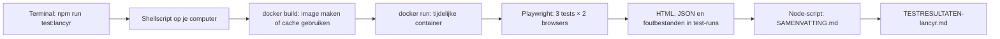

# Presentatiedocumentatie: Lancyr autoverzekering testen met Playwright

> **Kernboodschap:** dit project controleert automatisch een representatieve autoverzekeringsfunnel op de live Lancyr-site. Dezelfde test draait in Chromium en Firefox binnen Docker. Hij stopt vóór **Sluit af**.

Dit document is bedoeld als uitleg voor ICT-peers én als basis voor een presentatie. De gemarkeerde **Vertel dit**-regels zijn korte spreekpunten.

## 1. Het project in 30 seconden

Met één commando start je de tests:

```sh
npm run test:lancyr
```

Het project bouwt een Docker-image, start een tijdelijke container en draait drie Playwright-tests in twee browsers: **zes testresultaten**. De uitslag verschijnt in de terminal en wordt per run bewaard met datum en tijd. De langere test doorloopt de funnel tot de winkelwagen en klikt nooit op **Sluit af**.

**Vertel dit:** “Playwright speelt een klantreis na. `expect(...)` bepaalt op elke belangrijke plek of de website doet wat we verwachten. Docker levert voor iedereen dezelfde browseromgeving.”

## 2. Waarom deze opzet?

| Keuze | Reden |
| --- | --- |
| Playwright | Kan een echte browser bedienen en direct controleren wat zichtbaar of ingevuld is. |
| TypeScript | Geeft typecontrole en maakt fouten in de testcode sneller zichtbaar. |
| Chromium én Firefox | Dezelfde klantreis wordt in twee browserengines gecontroleerd zonder de test te kopiëren. |
| Docker | Browser en Linux-bibliotheken zitten in de image. De Fedora/WSL-host hoeft die niet zelf te leveren. |
| Eén startcommando | Het team hoeft geen lange `docker build`- en `docker run`-opdracht te onthouden. |
| Losse runmap | Nieuwe resultaten overschrijven oude screenshots en rapporten niet. |
| Stop vóór **Sluit af** | De test verstuurt geen definitieve aanvraag via die knop. |

**Belangrijke nuance:** de test gebruikt de live website. Eerdere stappen kunnen al serververzoeken doen. Stoppen vóór **Sluit af** garandeert dus niet dat er nergens tijdelijke gegevens op de server terechtkomen.

## 3. Hoe loopt een run door het systeem?



1. [package.json](package.json) koppelt `npm run test:lancyr` aan [run-lancyr-browsers.sh](scripts/run-lancyr-browsers.sh).
2. Het shellscript bouwt de image en maakt een unieke map onder `test-runs/`.
3. `docker run` start de container en voert binnen die container Playwright uit met `--project=chromium --project=firefox`.
4. Een bind mount koppelt de runmap op de host aan `/app/run-output` in de container. Daar komen het HTML-rapport, JSON-resultaat en eventuele screenshots en traces terecht.
5. Na de container-run leest [summarize-lancyr-run.mjs](scripts/summarize-lancyr-run.mjs) op de host het JSON-bestand. Het maakt `SAMENVATTING.md` en zet de nieuwe uitslag bovenaan [TESTRESULTATEN-lancyr.md](TESTRESULTATEN-lancyr.md).

**Vertel dit:** “De browser draait in Docker. De samenvatting wordt daarna buiten Docker gemaakt. Daardoor blijven de resultaten op mijn computer bestaan als de container alweer weg is.”

## 4. Project- en Git-structuur

```text
SQ1_playwright_Autover/
├── test/
│   ├── lancyr-autoverzekering.spec.ts  # echte funneltests
│   └── screenshot-demo.spec.ts          # bewust falende demo
├── scripts/
│   ├── run-lancyr-browsers.sh           # bouwt en draait Chromium + Firefox
│   ├── summarize-lancyr-run.mjs         # maakt leesbare uitslagen
│   └── run-screenshot-demo.sh           # draait alleen de screenshot-demo
├── playwright.config.ts                # Playwright-projecten en foutmateriaal
├── Dockerfile                           # recept voor de test-image
├── package.json                         # npm-commando's en dependencies
├── package-lock.json                    # exacte npm-versies
├── tsconfig.json                        # TypeScript-instellingen
├── TESTRESULTATEN-lancyr.md            # kort historisch overzicht
├── README*.md                           # start- en gebruiksinstructies
├── .gitignore                           # lokale bestanden buiten Git
└── .dockerignore                        # bestanden buiten de Docker-build
```

De Playwright-configuratie gebruikt `testDir: './test'`. Daarom horen de `.spec.ts`-bestanden in `test/`. Het Git-remote heet `origin` en wijst naar `Nukem17/SQ1_playwright_Autover`; tijdens het schrijven was de werkbranch `test-zion`. Controleer vóór je presentatie met `git branch --show-current` en `git status` welke branch en wijzigingen je op dat moment echt hebt. **Lokale wijzigingen worden pas gedeeld na commit en push.**

### Wat gaat wel en niet mee naar Git?

| In Git | Lokaal gehouden |
| --- | --- |
| Testcode, scripts, Dockerfile, configuratie, README's, `package-lock.json` | `node_modules/`, `test-runs/`, losse Playwright-rapporten en `test-results/` |
| `TESTRESULTATEN-lancyr.md` na commit en push | Screenshots, traces en ruwe JSON uit een run |

[.gitignore](.gitignore) bepaalt wat Git overslaat. [.dockerignore](.dockerignore) houdt onder meer `node_modules/`, `.git/` en oude resultaten buiten de image. Zo blijft de buildcontext kleiner. **Let op:** het script wijzigt `TESTRESULTATEN-lancyr.md` lokaal; het commit of pusht dat bestand niet automatisch. Verwijzingen naar `test-runs/...` in dat overzicht werken alleen op een computer waar die lokale runmap bestaat.

**Vertel dit:** “Git bewaart de reproduceerbare broncode en het korte overzicht. De grote, mogelijk gevoelige browserverzameling blijft lokaal.”

## 5. Wat test Playwright precies?

[lancyr-autoverzekering.spec.ts](test/lancyr-autoverzekering.spec.ts) bevat drie tests. Ze draaien alle drie in Chromium én Firefox.

| Test | Wat is goed? |
| --- | --- |
| Ingang zichtbaar | Paginatitel, verplicht kentekenveld en **Bereken Premie** zijn zichtbaar. |
| Leeg kenteken | Een klik met een leeg kenteken houdt de gebruiker op de autopagina. |
| Volledige route | De opgegeven gegevens kunnen worden ingevuld, de volgende stappen verschijnen, WA + en een positieve jaarpremie zijn zichtbaar, en de winkelwagen toont twee uitgevinkte extra keuzes. |

De lange route bestaat in het HTML-rapport uit zes `test.step`-delen:

1. **Navigatie:** homepage → Privé verzekeren → Auto; controle van de autopagina.
2. **Voertuig:** kenteken invullen; wachten tot de site de Toyota Prius herkent; **Bereken Premie** openen.
3. **Situatie:** adres, geboortedatum, ondernemerschap, gezinssamenstelling en privacykeuze invullen en controleren.
4. **Rijgegevens:** hoofdbestuurder, zes schadevrije jaren, 15.000–20.000 km en de eerstvolgende 20 september; premie starten.
5. **Dekking en aanbod:** WA + kiezen. Op de aanbodpagina moet WA + geselecteerd zijn en een zichtbare jaarpremie boven nul staan. Daarna wordt het zichtbare aanbod gekozen.
6. **Winkelwagen:** controleren dat de twee optionele extra dekkingen uit staan, WA+ zichtbaar is en **Sluit af** in beeld komt. **Daar stopt de test.**

De test vraagt geen e-mail of telefoonnummer, omdat vóór **Sluit af** in deze route geen apart formulier voor de verzekeringnemer verscheen. De naam a.s.r. en een exact premiebedrag zijn geen vaste verwachtingen: het aanbod en de prijs kunnen wijzigen.

### Hoe weet Playwright of iets slaagt?

`page` is het browsertabblad van de test. Locators zoals `getByRole(...)`, `getByText(...)` en `locator(...)` zoeken een onderdeel op de pagina. Acties zoals `.click()`, `.fill()`, `.check()` en `.selectOption()` bedienen de website. Daarna controleert `expect(...)` de uitkomst, bijvoorbeeld met `toBeVisible()`, `toHaveValue()`, `toBeChecked()` of `toHaveURL()`.

Als een vereiste controle niet binnen de wachttijd slaagt, faalt de test. De zichtbaarheid wordt bewust vóór en na belangrijke acties gecontroleerd. Sommige onderdelen hebben een sitegebonden CSS-selector omdat de website daar geen bruikbare toegankelijke naam biedt; die selectors kunnen onderhoud vragen als Lancyr de HTML verandert.

### Hulpfuncties die je moet kunnen uitleggen

| Functie / onderdeel | Wat doet het? | Waarom zo? |
| --- | --- | --- |
| `sluitCookieMelding(page)` | Slaat de cookiekeuze op als de melding verschijnt. | De banner kan anders knoppen afdekken; soms is hij er al niet meer. |
| `vulVeld(page, naam, waarde)` | Zoekt een invoerveld, checkt zichtbaarheid, vult het in en checkt de waarde. | Vermijdt dezelfde vier regels bij ieder adres- en datumveld. |
| `ingangsdatum()` | Geeft de eerstvolgende 20 september in `YYYY-MM-DD` terug. | De test blijft ook na 20 september bruikbaar. |
| `test.step(...)` | Groepeert de lange klantreis in zes stukken. | Het rapport laat zien waar een fout optreedt. |
| `test.skip(...)` | Slaat de lange route over als geen testkenteken is meegegeven. | Voorkomt een misleidende test met ontbrekende invoer. |
| `amsterdamTime(iso)` | Zet een UTC-tijd om naar Nederlandse tijd. | Het resultatenoverzicht is voor het team direct leesbaar. |
| `allSpecs(suites)` | Loopt door geneste Playwright-resultaatgroepen. | Zo komen alle tests, ook per browser, in de samenvatting. |

In [playwright.config.ts](playwright.config.ts) staan de browserprojecten en de regel dat screenshots en traces alleen bij fouten worden bewaard. `fullyParallel` staat aan; het runscript beperkt het werk met `--workers=2`. De configuratie bevat ook WebKit, maar het gewone startcommando selecteert alleen Chromium en Firefox. In CI staan extra opties voor retries en het blokkeren van per ongeluk achtergelaten `test.only`; er is op dit moment nog geen CI-workflow.

**Vertel dit:** “Alleen een klik uitvoeren is niet genoeg. We controleren ook of de juiste pagina, keuze en gegevens daarna echt verschijnen.”

## 6. Wat doet Docker precies?

De [Dockerfile](Dockerfile) begint met `mcr.microsoft.com/playwright:v1.63.0-noble`. Die basisimage levert de Playwright-browsers en benodigde Linux-bibliotheken. Daarna kopieert Docker `package.json` en `package-lock.json`, voert `npm ci` uit en kopieert de testcode. De pakketstap kan bij ongewijzigde bestanden uit de Docker-cache komen.

Het shellscript gebruikt twee Docker-opdrachten:

- `docker build -t sq1-playwright .` maakt of vernieuwt de lokale image.
- `docker run ... sq1-playwright npx playwright test ...` start één tijdelijke container en draait daarin de tests.

Belangrijke `docker run`-onderdelen:

| Onderdeel | Waarom staat het erin? |
| --- | --- |
| `--rm` | Verwijdert de container na afloop. **De image en rapporten blijven staan.** |
| `--init` | Laat een klein init-proces browserprocessen netjes opruimen. |
| `--ipc=host` | Geeft de browsers toegang tot meer gedeeld geheugen op de host. |
| `--user "$(id -u):$(id -g)"` | Maakt bestanden met jouw gebruikersrechten; je kunt ze later verwijderen. |
| `-e ...` | Geeft het kenteken en de rapportpaden aan de container door. |
| `-v "$run_dir:/app/run-output"` | Bewaart containeruitvoer direct in jouw lokale runmap. |
| `--workers=2` | Laat maximaal twee Playwright-workers tegelijk draaien. |
| `--reporter=list,html,json` | Terminaluitslag, HTML-rapport en JSON voor de samenvatting. |

De `CMD` in de Dockerfile is een standaardcommando. Het runscript geeft achter de imagenaam een concreter Playwright-commando mee en **overschrijft daarmee die standaard**. Er wordt geen webserver in de container gestart. De browser in de container bezoekt de live Lancyr-site via het netwerk.

Op de host heb je Node.js/npm, Bash en een draaiende Docker Engine nodig. De tests draaien standaard zonder zichtbaar browservenster; je kijkt achteraf in het rapport. Docker Desktop is hiervoor niet verplicht; in deze WSL-omgeving wordt de Engine zonder Docker Desktop gebruikt. De image `sq1-playwright` blijft na een run lokaal staan; alleen de container wordt door `--rm` verwijderd.

Het shellscript begint met `set -euo pipefail`: gewone scriptfouten stoppen de run. De test-exitcode wordt apart opgevangen, zodat ook na een **mislukte test** nog een samenvatting wordt geschreven. Het script geeft diezelfde exitcode terug; een fout blijft dus een fout in de terminal of een latere pipeline.

## 7. Rapporten en fouten uitleggen

Iedere run krijgt een map als `test-runs/2026-09-17_13-20-32_oVK5tL/`. De naam bevat datum, tijd en een unieke suffix. Daardoor overschrijft een nieuwe run de vorige niet.

| Bestand | Gebruik tijdens de presentatie |
| --- | --- |
| `SAMENVATTING.md` | Toon de zes uitslagen met browsernaam. |
| `html/index.html` | Open de stappen en eventuele foutdetails in het Playwright-rapport. |
| `results.json` | Laat zien dat de leesbare samenvatting uit gestructureerde testdata wordt gemaakt. |
| `test-results/` | Bij een fout: screenshot, trace en foutcontext. |

De configuratie bewaart screenshots en traces **alleen bij een mislukte test**. Een screenshot laat de pagina zien op het moment van falen; de trace laat ook eerdere acties zien. De aparte [screenshot-demo](test/screenshot-demo.spec.ts) faalt expres op de echte autopagina. Start die met `npm run test:screenshot-demo`. Hij hoort niet bij de gewone Lancyr-run; het demoscript controleert of er daadwerkelijk een PNG is gemaakt.

De meest recente gecontroleerde run op 17 september 2026 had **6 geslaagde tests: 3 in Chromium en 3 in Firefox**. Dit is een momentopname van de live website, geen garantie voor toekomstige runs.

**Vertel dit:** “Een rode test is niet automatisch een bug in Lancyr. Ik kijk eerst in de screenshot en trace of de site, selector, testdata of wachttijd de oorzaak is.”

## 8. Grenzen en verbeterpunten

Wat de test **wel** bewijst: deze specifieke klantreis werkte tijdens de run in beide browsers, met zichtbare hoofdonderdelen, ingevulde waarden, WA + en een positieve premie.

Wat hij **niet** bewijst:

- dat de site op mobiel en tablet responsive is;
- dat iedere mogelijke invoer, verzekeraar of dekking werkt;
- dat de exacte premie inhoudelijk juist is;
- dat de aanvraag na **Sluit af** goed wordt verwerkt;
- dat de live site nooit tijdelijk traag is of wijzigt.

Een logische volgende stap is extra scenario's toevoegen, zoals een ongeldig kenteken of mobiele schermbreedte. Doe dat pas met expliciete verwachtingen: *welk element moet zichtbaar zijn, welke waarde klopt, en wat moet er gebeuren bij een fout?* Voor veel geplande runs op de live website moet ook worden afgestemd of eerdere funnelstappen tijdelijke orders of administratie aanmaken.

## 9. Git en mogelijke CI/CD

De normale Git-route is: werken op een branch → wijzigingen reviewen → committen → pushen → eventueel samenvoegen. `git status` toont welke code en documentatie nog lokaal gewijzigd is. De `.gitignore` houdt grote runmappen buiten commits. Daardoor kan een collega de repo clonen en de tests zelf opnieuw draaien, maar ziet die collega niet automatisch jouw lokale HTML-rapporten.

Er staat momenteel **geen GitHub Actions-workflow** in de repo. Later kan een pipeline dezelfde `npm run test:lancyr` uitvoeren en `test-runs/` als artifact bewaren. Het script wijzigt dan wel `TESTRESULTATEN-lancyr.md` in de tijdelijke CI-werkmap; zonder extra commit- en pushstap komt die wijziging niet terug in Git.

**Vertel dit:** “De repository bewaart hoe we testen. Een run produceert bewijs. In CI moet je dat bewijs expliciet als artifact bewaren.”

## 10. Voorstel voor je slides

| Slide | Titel | Laat zien / zeg |
| --- | --- | --- |
| 1 | Doel | Welke klantreis en waarom stoppen vóór **Sluit af**. |
| 2 | Architectuur | Het diagram uit hoofdstuk 3: host, Docker, Playwright en rapporten. |
| 3 | Repository | De projectboom en het verschil tussen Git-broncode en lokale resultaten. |
| 4 | Testontwerp | Drie tests, zes stappen in de funnel, Chromium + Firefox. |
| 5 | Assertions | Eén concreet voorbeeld: zichtbaar veld → actie → verwachte pagina/waarde. |
| 6 | Docker | Dockerfile, build, tijdelijke container en bind mount. |
| 7 | Resultaten | `SAMENVATTING.md`, HTML-rapport en screenshot bij falen. |
| 8 | Grenzen | Live site, geen definitieve aanvraag, geen responsive test, vervolgstappen. |

**Korte live demo:** voer `npm run test:lancyr` uit, wijs in de terminal de labels `[chromium]` en `[firefox]` aan en open de nieuwste `SAMENVATTING.md`. Heb je geen tijd om de hele funnel te draaien, gebruik dan een bewaarde run en laat daarna de screenshot-demo zien.

## 11. Vragen die peers waarschijnlijk stellen

**Waarom Docker als Playwright zelf browsers kan installeren?**  
Op deze Fedora/WSL-host ontbreken browserbibliotheken. De Docker-image levert een vaste omgeving. Firefox kan op een geschikte computer ook lokaal draaien; zie [README-oumaima.md](README-oumaima.md).

**Waarom zes resultaten terwijl er drie tests zijn?**  
Playwright draait iedere test in twee geselecteerde browserprojecten: 3 × 2 = 6. WebKit staat wel in de configuratie, maar het runscript selecteert die browser niet.

**Verdwijnt de image na een run?**  
Nee. `--rm` verwijdert alleen de container. De image en de runmappen blijven totdat je ze zelf verwijdert.

**Waarom staat een geslaagde run niet automatisch op GitHub?**  
Rapporten staan in het genegeerde `test-runs/`. Het korte overzicht wordt lokaal bijgewerkt, maar commit en push zijn aparte Git-acties.

**Is 6/6 groen genoeg om te zeggen dat de hele site werkt?**  
Nee. Het bewijst alleen dat deze gekozen controles in deze twee browsers op dat moment slaagden. De grenzen staan in hoofdstuk 8.
